# AWS-Networking-Implementation (VPC, Subnets, IG, NAT, Routing)

## VPC Creation and Subnet Configuration

### Amazon VPC 

An Amazon Virtual Private Cloud (VPC) is your own private section of the Amazon cloud where you can place and manage your resources such as servers or databases. You have control over who can go in and out.

### Steps in creating a VPC and configuring core network services includes:
- The Default VPC
- Creating a new VPC
- Creating and configuring subnets

### The Default VPC
This is a starter pack provided by Amazon for your cloud resources. It's a pre-configured space in the Amazon cloud where you can immediately start launching Amazon EC2 instances. It has built-in security and network settings to help you to get up and running quickly.

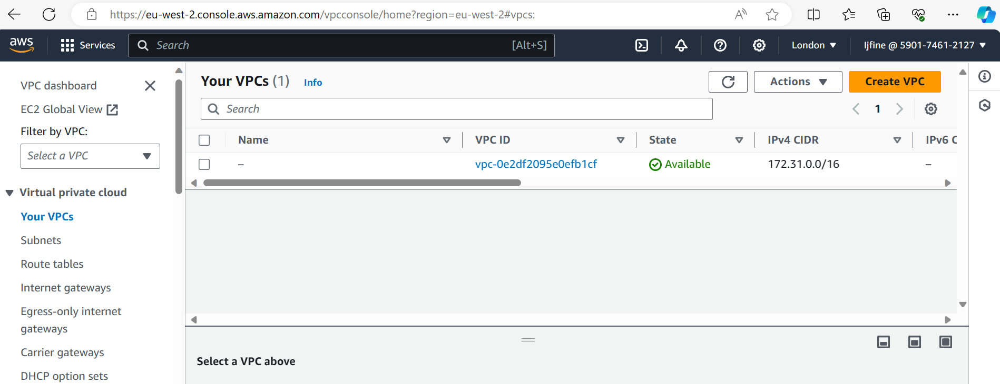

A default VPC, which Amazon provides in each region is like a pre-built house in a city and it comes with some default settings to help you start deploying your applications immediately.

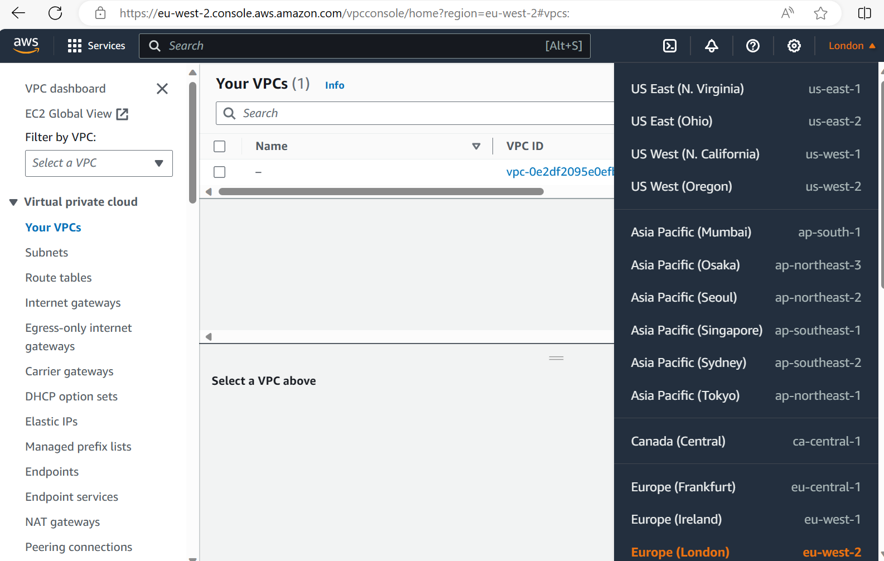

### Creating a new VPC
To create a new VPC, choose the VPC only option. Enter "first-vpc" as the name tag and "10.0.0.0/16" as the IPv4 CIDR. The "10.0.0.0/16" will be the primary IPv4 block and you can add IPv4 block e.g., "100.64.0.0/16".

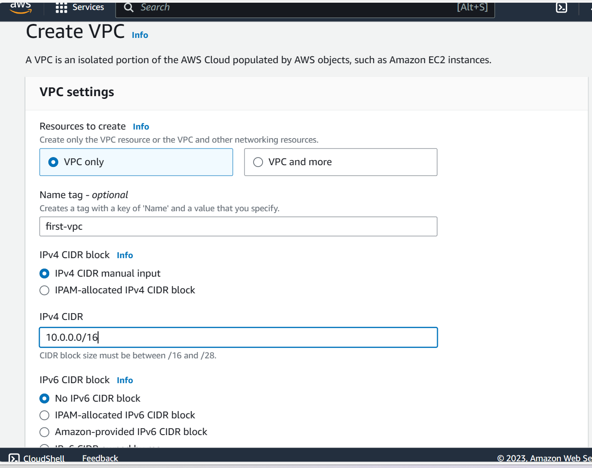

Once VPC is created, it's assigned with a vpc-id and there is a route table created that serves as the main route table.

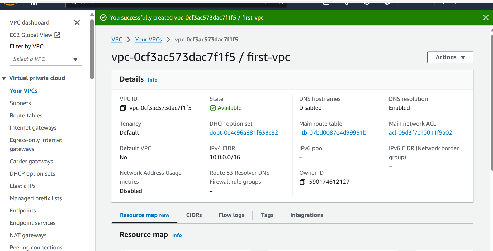

Although you have a VPC and a route table now, you won't be able to create an EC2 instance or put anything inside yet as it needs subnets to be able to do so.

### Creating and Configuring Subnets
**Subnets description**

Subnets are a range of IP addresses and a section in your VPC that allows you to group resources.It can have different security or operations needs and can be both public and private. See the illustration below:

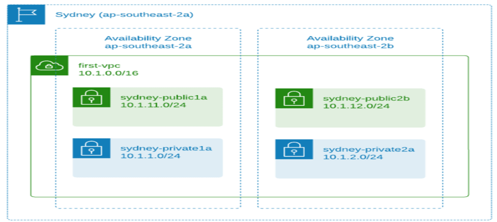

**Subnet name      AZ        CIDR block**

subnet-public1a eu-north-1a 10.0.11.0/24
subnet-public2b eu-north-1b 10.0.12.0/24
subnet-private1a eu-north-1a 10.0.1.0/24
subnet-private2b eu-north-1b 10.0.2.0/24

To create subnets, follow the below steps:
- Go to VPC
- Click on Subnets
- Click on create Subnets
- Select the VPC you created previously
- Select the zone
- choose your IPv4 CIDR block. Ensure you plan your subnets CIDR blocks to avoid overlapping CIDR.

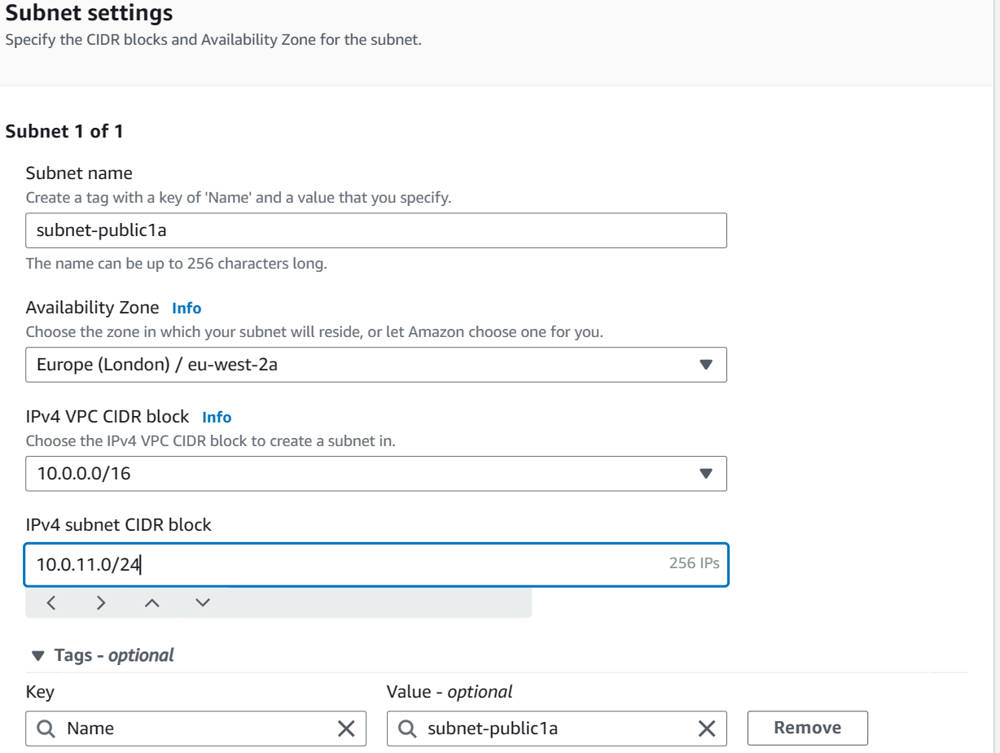

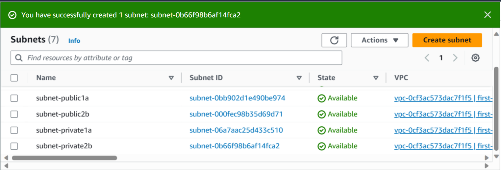

Now, you can deploy EC2 instances into VPC by selecting one of the subnets.

## Understanding Public and Private Subnets in AWS VPC

A public subnet is a subnet that has a route to an Internet Gateway, which allows access from public internet to the subnet whereas, a private subnet is a subnet that does not have a route to Internet Gateway, which prevents access from the internet to the subnet.

### How to Create a Public Subnet
Follow the below steps:
- Go to AWS VPC page.
- Find 'Subnets' and click on it.
- Click on 'create subnet'.
- Name your subnet, and leave the IP settings as they are.
- Attach an Internet Gateway to this subnet to provide the internet access.
- Update the route table associated with this subnet to allow traffic to flow to and from the internet.

### How to Create a Private Subnet
Below is how to do it:
- Go to AWS VPC page.
- Find 'Subnets' and click on it.
- Click on 'create subnet'.
- Name your subnet, and leave the IP settings as they are.
- Don't attach an Internet Gateway to this subnet, keeping it secluded.
- The route table for this subnet doesn't allow direct traffic to and from the internet.

### Working with Public and Private Subnets
Public subnets are great for resources that need to connect to the internet, like web servers. Private subnets are great for resources that you don't want to expose to the internet, like databases.

## Internet Gateway and Routing Table

### What is an Internet Gateway
An Internet Gateway is a device or service that connects a network to the internet. It can be an internet provider to your home or VPC component that allows communication between your VPC and internet in a cloud environment.

### Public Subnets
Subnets are still private but you'll need the following to make it work as public subnets:
- An Internet Gateway (IGW) attached to the VPC.
- Route table with default route towards the IGW.
- Public IP assigned to the AWS resources.

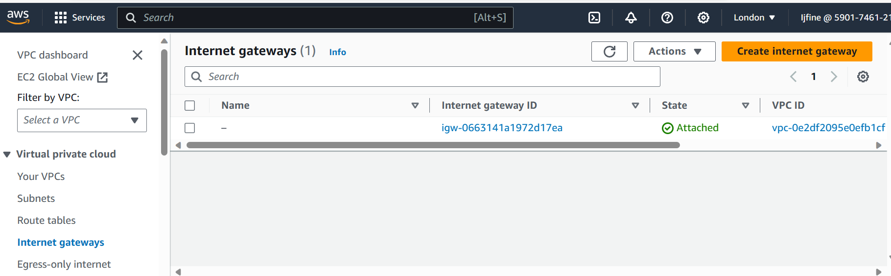

To do this:
- Go to VPC.
- Click on Internet gateway.
- Click on 'Create internet gateway'.
- Add a name tag.

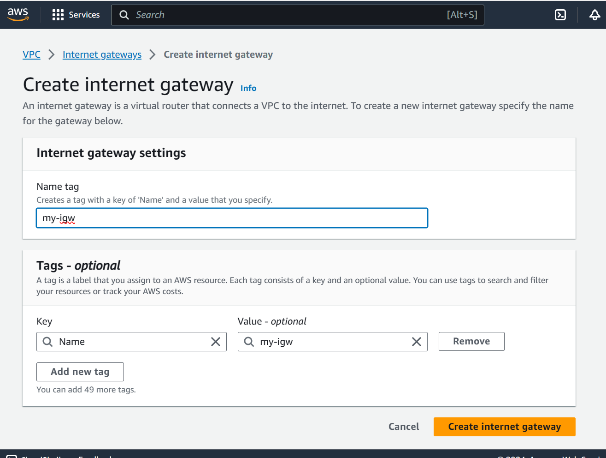

Next is to attach the IGW to your VPC.
- Go to actions and click on the drop down arrow.
- Click on attach VPC.
- Under available VPC, select your VPC.
- Click on attach internet gateway.

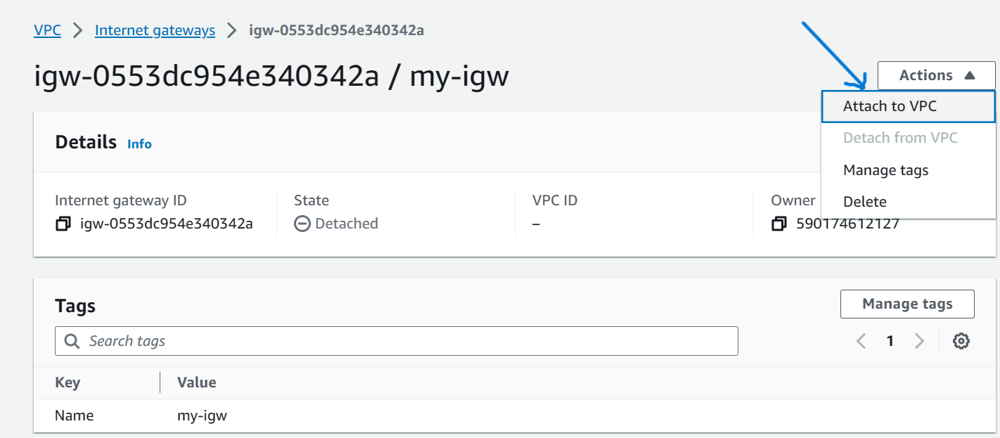

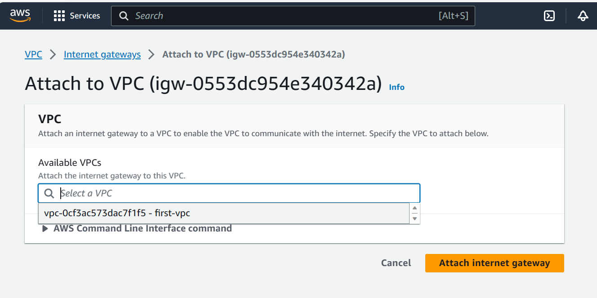

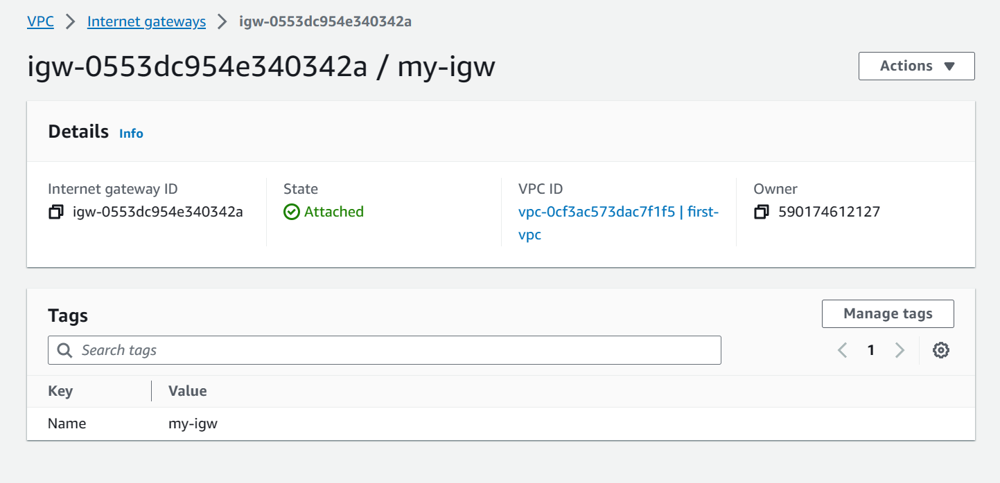

## What is a Routing Table?
A routing table is a data file that is used to determine where data packets travelling over an IP network will be directed.

### Creating and Configuring Routing Table
Now that we ahve our Internet Gateway, we need to give directions to our resources, which is done through a Routing Table.
- Go to VPC.
- Click in Route tables.
- Click on create route table.
- Give it a name.
- Select your previously created VPC.

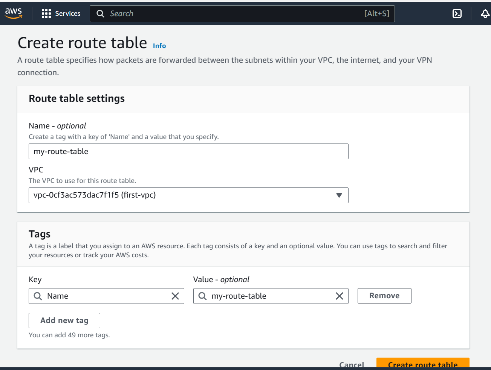

Once route table have been created;
- Select the created route table.
- Click on Action drop down button and select edit route.
- Add a default route to the Internet Gateway (IGW).

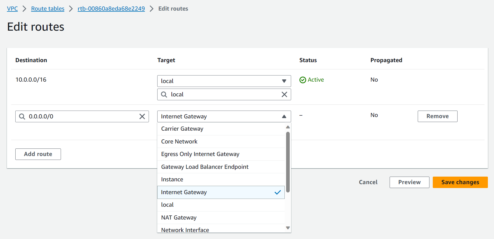

- Select Internet Gateway and choose the previously created IGW.

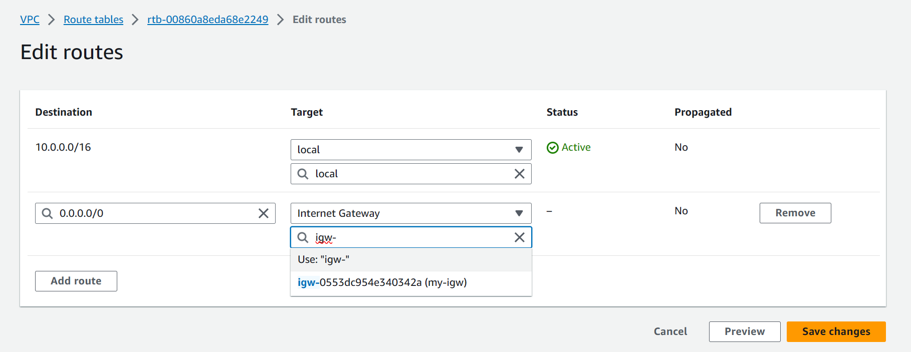

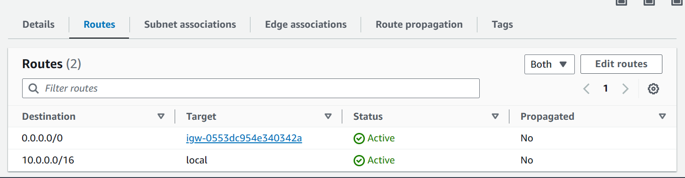

- Go to the Subnet associations tab.
- Click on Edit subnet association.

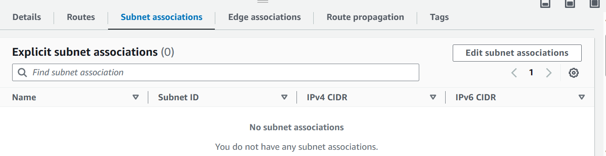

- Select the public subnets and click on save associations.

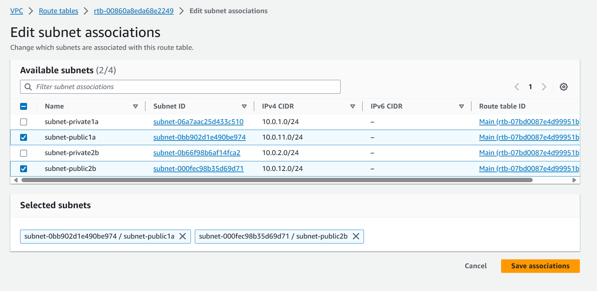

Now that the VPC is ready, you can an EC2 instance in public subnets if they need internet access or in private if they don't.

Below is created Route table for private but subnets and routes are not yet been attached to it.

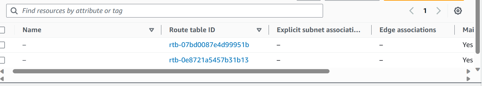

## NAT Gateway and Private Subnets
In AWS VPC, private subnets are secluded areas where you can place resources that should not be directly exposed to the internet. NAT Gateway comes in to play when these resources need to access the internet for updates or downloads.

### Understanding NAT Gateway 
A Network Address Translation (NAT) Gateway is used to enable instances present in a private subnet to connect to the internet or AWS services. It works by translating the private IP addresses of instances within a private subnet to public IP addresses. It gives cloud resoureces without public IP addresses access to the internet without exposing those resources to incoming internet connections.

### Creating a NAT Gateway and Linking it to a Private Subnet
- Go to VPC.
- Click on NAT Gateways.
- Click on Create Nat gateway.

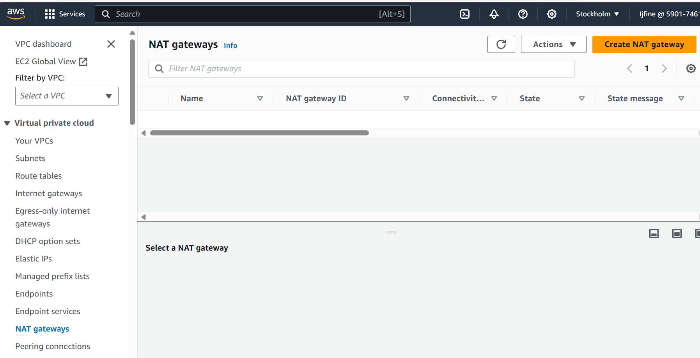

- Name your NAT gateway.
- Choose one of the private subnets created previously.
- Allocate Elastic IP as is required for the creation of NAT gateway.

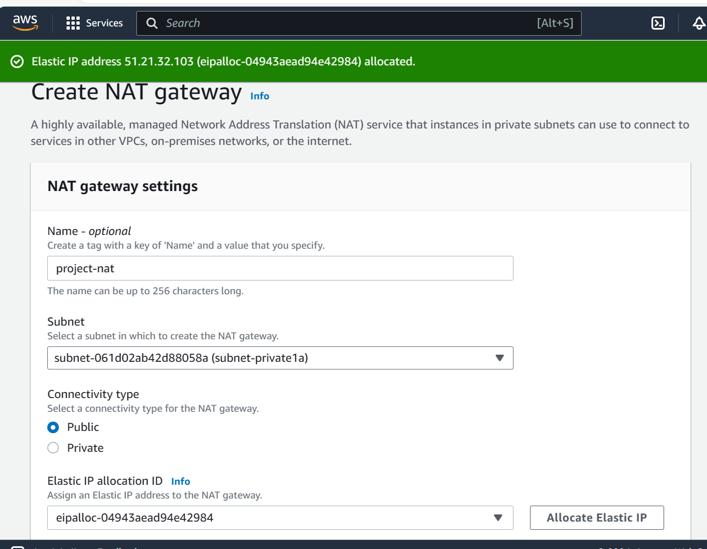

Now, go to the route table menu and create a route table for the private subnets.

Edit the route table and add a default route to the NAT Gateway.

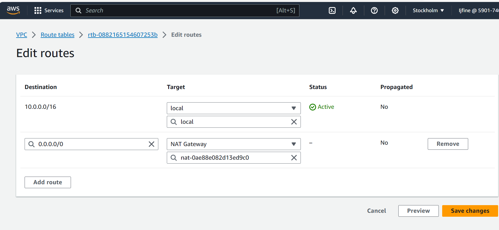

Go to subnet associations tab and click on edit subnet associations.

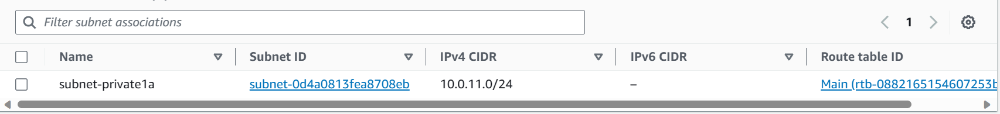

## Security Group and Network ACLs
### The difference between Security Groups and Network Access Control Lists
Security groups and network access control lists (ACLs) are both important tools for securing your network on the AWS cloud, but they serve different purposes and have different use cases.

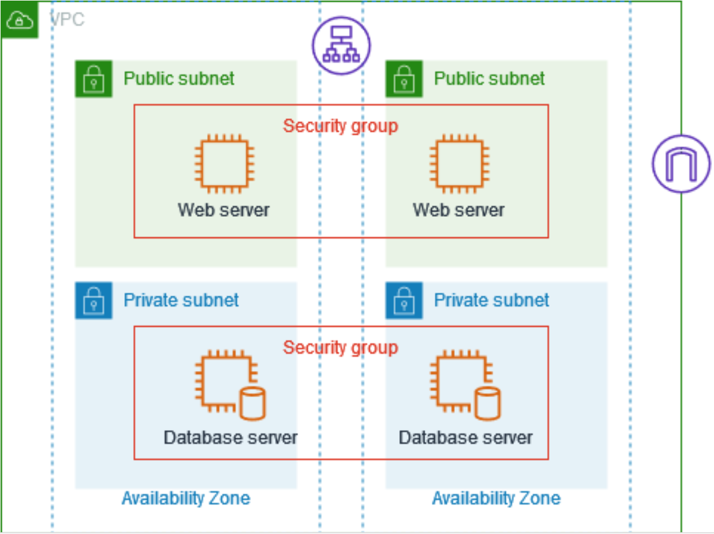

Security group acts as a virtual firewall for your EC2 instances to control incoming and outgoing traffic. Both inbound and outbound rules control the flow of traffic to and from your instance, respectively. It helps you secure your cloud environment by controlling how traffic will be allowed into your EC2 machines. With security groups, you can ensure that all the traffic that flows at the instance level is only through your established ports and protocols. When launching an EC2 instance, you need to assign it to a particular security group. You can add rules to each security group that allow traffic to or from designated services including associated instances.

Generally, security groups provide an essential layer of security for your cloud resources by allowing you to define and manage access control policies.