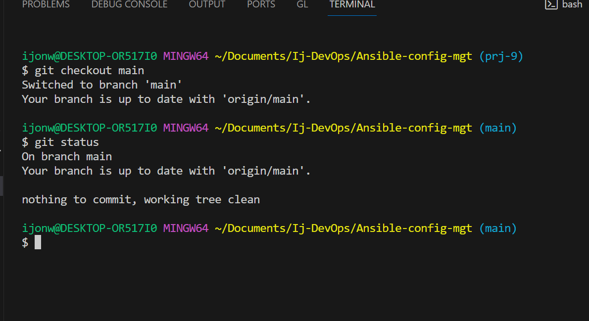

# Ansible-Automate Project

This is testing that Jenkins build jo automatically.

## Prerequisites
- Have a cloud service provider such as AWS.
- Launch an instance using Ubuntu as the AMI, install and configure Jenkins on the instance.
- Have a Github account and create a new repository. 
- Launch four instances using RedHat as the AMI, One instance to serve as NFS server, two instances as webservers and one as a database server.
- Launch an instance with Ubuntu as the AMI which will serve as a loadbalancer.

## Install and Configure Ansible on EC2 Instance

Step 1 - 

1.  Update the name of your `Jenkins` EC2 instance to `Jenkins-Ansible`. This server will be used to run ansible playbooks.

2.  Open your GitHub account and create a new repository called `ansible-config-mgt`.

3.  Install Ansible on the Jenkins EC2 instance. Use the below command:

```python
sudo apt update

sudo apt install ansible

```
- Check the version of Ansible installed byt running `ansible --version`


4.  Configure Jenkins build job to automatically archive your repository content each time you change it. Follow the below steps:

- Open your Jenkins server.
- Create a new Freestyle project `ansible` in Jenkins and make it point to your `ansible-config-mgt` repository.
- Under source code management, click on Git, paste your repository URL in the required space.


- Click on GitHub hook trigger for GITScm pooling which is listed under build triggers.


- Configure a webhook in GitHub and set the webhook to trigger ansible build. On your repository, click on setting and then select webhooks from the list. 
Click on add webhooks and provide your Jenkins IP address in the column provided as shown below:

````python
<Jenkins-IP-address>:8080/github-webhook/
````

- Configure a Post-build job to save all `(**)` files.


5.  To test that your setup is working, make some changes in README.md file in your main/master branch and confirm that it builds automatically on Jenkins. Check that Jenkins saves the files in build artifact folder by running the below command on your terminal:

```python
ls /var/lib/jenkins/jobs/ansible/builds/<build_number>/archive/
```


**Step 2 - Prepare your Development Environment using Visual Studio Code**

1. Install Visual Studio Code on your PC if you don't have it already. This will serve as your integrated development environment.

2. After installation, configure it to connect to your newly created GitHub repository.

3. Clone down your ansible-config-mgt repo. Use this command:  `git clone`


**Step 3 - Begin Ansible Development**

1. Create a new branch and check into it, in your ansible-config-mgt GitHub repository.  The neew branch will be used for development of new feature. Use the below command;

```python
git checkout -b <branch-name>
```


2. Create a directory and name it `playbooks`. It will be used to store all your playbooks files.

3. Create another directory and name it `inventory`. It will be used to keep your hosts organised.

4. Within the playbooks directory, create your first playbooks and call it `common.yml`. 

5. Within the inventory folder, create an inventory file for each environment (Development, Staging, Testing and Production) and name them `dev`, `staging`, `uat` and `prod` respectively. 


**Step 4 - Set up an Ansible Inventory**

An Ansible inventory deines the hosts and group of hosts upon which commands, modules and tasks in a playbook operate. Save the below inventory structure in the `inventory/dev` file. Ensure to replace the IP addresses accordingly with your own servers addresses.

```python
[nfs]
<NFS-Server-Private-IP-Address> ansible_ssh_user=ec2-user

[webservers]
<Web-Server1-Private-IP-Address> ansible_ssh_user=ec2-user
<Web-Server2-Private-IP-Address> ansible_ssh_user=ec2-user

[db]
<Database-Private-IP-Address> ansible_ssh_user=ec2-user 

[lb]
<Load-Balancer-Private-IP-Address> ansible_ssh_user=ubuntu
```


Implement the concept of `ssh-agent` as Ansible needs to ssh into target servers from `Jenkins-Ansible` host. Follow the below step:

- On your terminal, ***cd*** into the folder where you saved your key-pair used for launching instance.
- Run the below commands respectively:

```python
eval `ssh-agent -s`
ssh-add <path-to-private-key>
```
- Confirm the key hasbeen added with the below command:

````python
ssh-add -l 
````
- ssh into your `Jenkins-Ansible` server using ssh-agent. Run the below command:

```python
ssh -A ubuntu@public-ip
```


**Step 5 - Create a Common Playbook**

In `common.yml` folder, configure repeatable, re-usable and multi-machine tasks that is common within the infrastructure.
Update your `common.yml` folder with the below code:

```python
---
- name: update web, nfs and db servers
  hosts: webservers, nfs, db
  become: yes
  tasks:
    - name: ensure wireshark is at the latest version
      yum:
        name: wireshark
        state: latest
   

- name: update LB server
  hosts: lb
  become: yes
  tasks:
    - name: Update apt repo
      apt: 
        update_cache: yes

    - name: ensure wireshark is at the latest version
      apt:
        name: wireshark
        state: latest
```

**Step 6 - Update Git with the Latest Code**

1. Use git commands to add, commit and push your branch to GitHub. Run the below commands:

```python
git status

git add <selected files>

git commit -m "commit message"
```


2. Create a Pull request (PR).


3. Merge the code to the main/master branch.


4. On your terminal, checkout from the feature branch into the main and pull down the latest changes. Run the below commands respectively:

```python
git checkout main

git pull
```



By doing the above, Jenkins will automatically build artifacts to `/var/lib/jenkins/jobs/ansible/builds/<build_number>/archive`.

**Step 7 - Run First Ansible Test**

To run your playbook, go to your Jenkins-Ansible instance in your terminal and run the below command:

```python
ansible-playbook -i /var/lib/jenkins/jobs/ansible/builds/<build_number>/archive/inventory/dev.yml /var/lib/jenkins/jobs/ansible/builds/<build_number>/archive/playbooks/common.yml
```
**Note:** Ensure to replace the build_number with the actual latest number of your Jenkins builds.


To confirm the above command was successful, go to each server and check if wireshark was installed by running `wireshark --version` or `which wireshark`.


