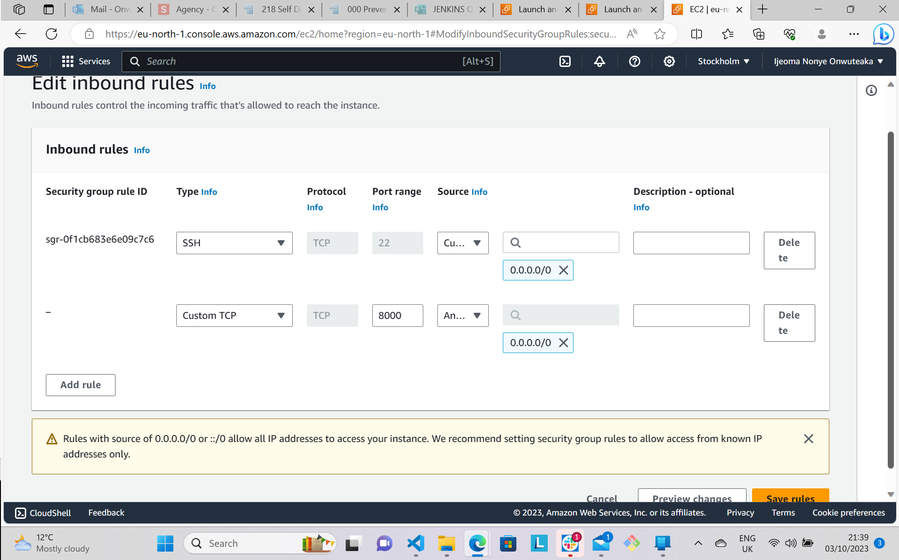
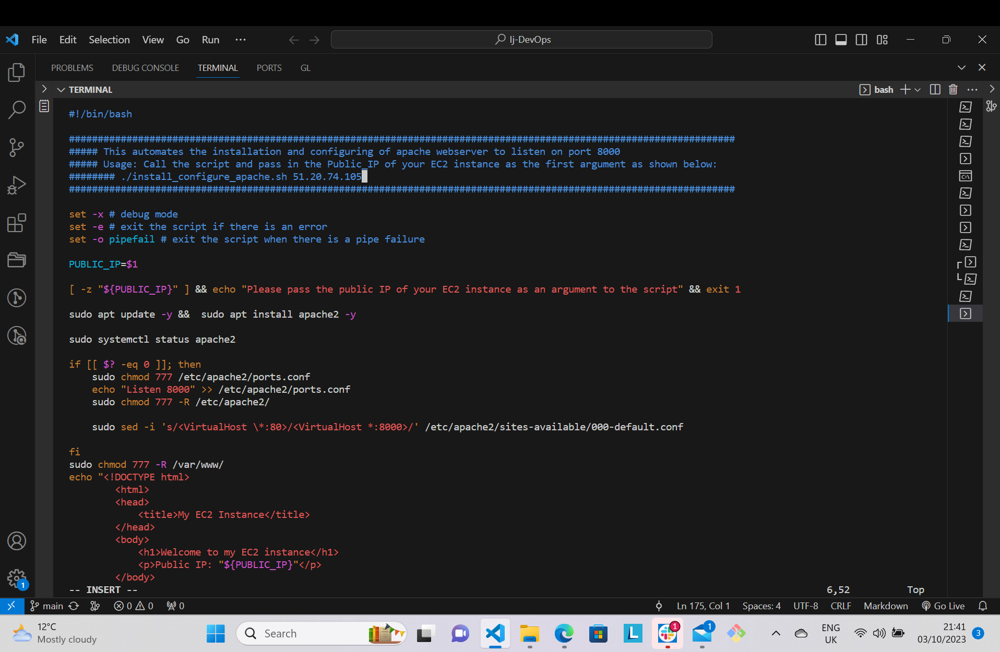
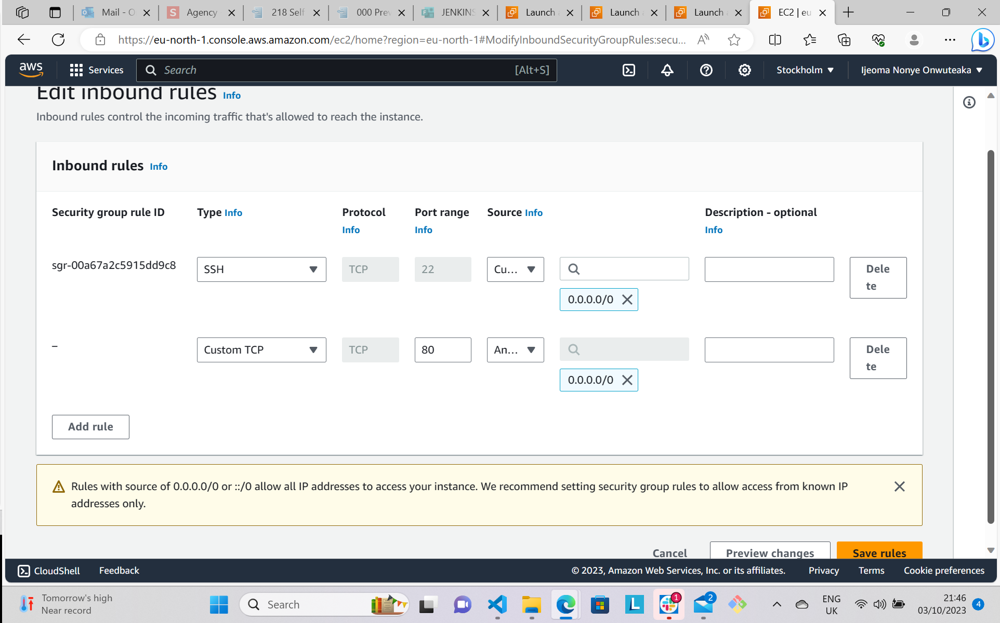
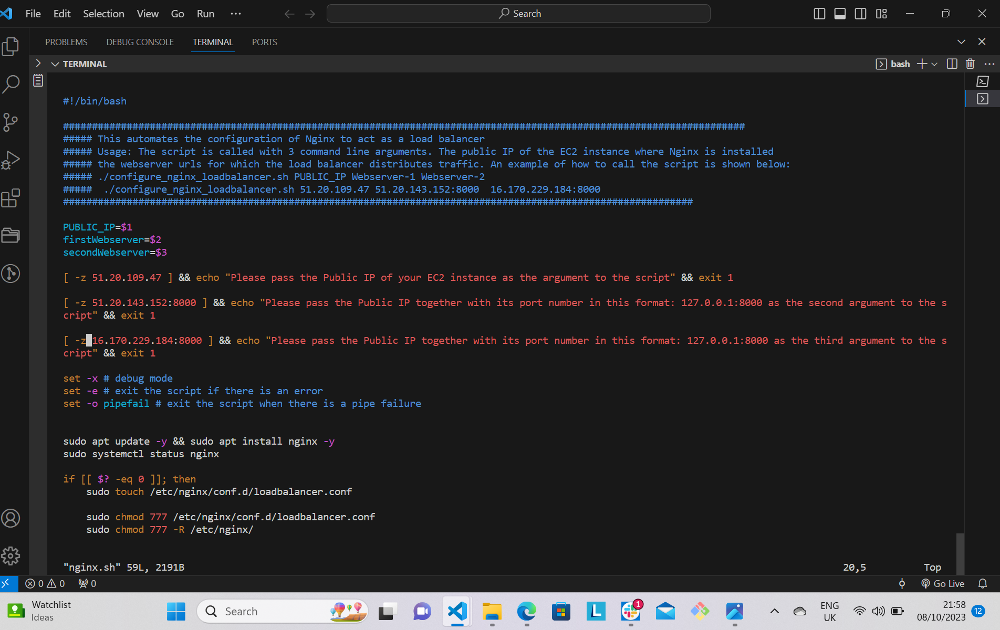
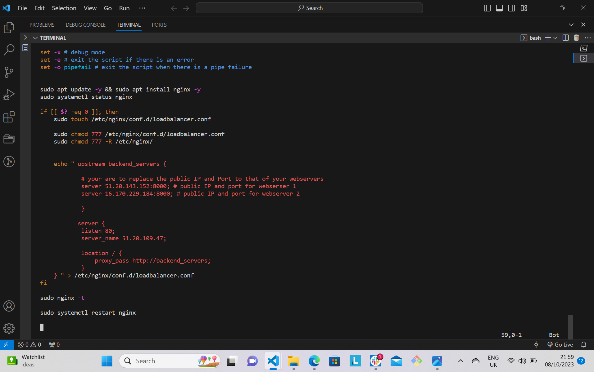
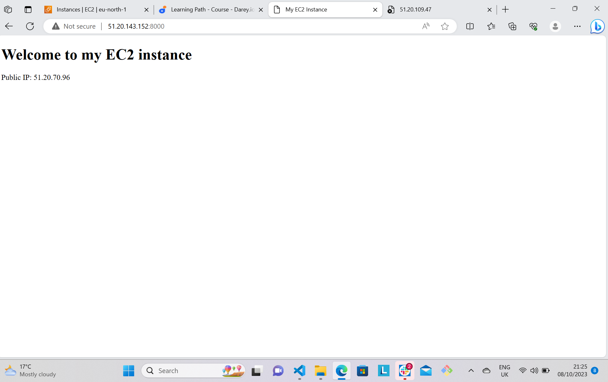
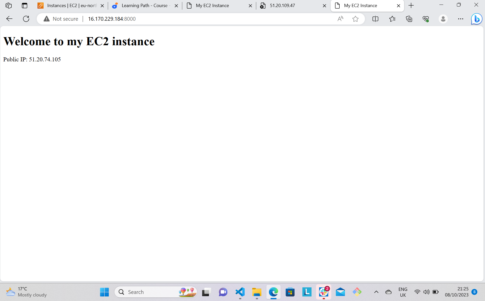
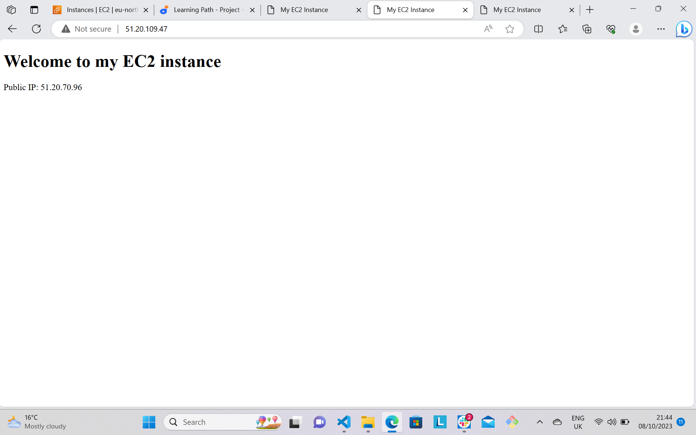

# Automating Load Balancer Configuration with Shell Scripting

## Prerequisites
-  Have a Cloud Service Provider such as AWS.
- Launch two instances for webserver and one instance for load balancer. It is more advisable to Choose Ubuntu as the AMI of the instance.
- Connect your instances to your virtual host through SSH.

## Deploying and Configuring the Webservers

To do this, you will open two instances.

**Step 1**: Open the first EC2 instance and choose ubuntu 20.04 as the AMI.

**Step 2**: Open port 8000 and allow traffic from anywhere through the security group. To do this, follow these steps - 
- Click on the instance and got to security
- Click on security groups
- Click on edit inbound rule
- Open port 8000 and allow traffic from anywhere
- Click on add rule



**Step 3**: Connect to the webserver through your terminal by using SSH client.

**Step 4**: Using any text editor, open a file called *install.sh*. Run this command:

```python
'sudo vi install.sh'
```
Paste the below script 

```python
#!/bin/bash

####################################################################################################################
##### This automates the installation and configuring of apache webserver to listen on port 8000
##### Usage: Call the script and pass in the Public_IP of your EC2 instance as the first argument as shown below:
######## ./install_configure_apache.sh 127.0.0.1
####################################################################################################################

set -x # debug mode
set -e # exit the script if there is an error
set -o pipefail # exit the script when there is a pipe failure

PUBLIC_IP=$1

[ -z "${PUBLIC_IP}" ] && echo "Please pass the public IP of your EC2 instance as an argument to the script" && exit 1

sudo apt update -y &&  sudo apt install apache2 -y

sudo systemctl status apache2

if [[ $? -eq 0 ]]; then
    sudo chmod 777 /etc/apache2/ports.conf
    echo "Listen 8000" >> /etc/apache2/ports.conf
    sudo chmod 777 -R /etc/apache2/

    sudo sed -i 's/<VirtualHost \*:80>/<VirtualHost *:8000>/' /etc/apache2/sites-available/000-default.conf

fi
sudo chmod 777 -R /var/www/
echo "<!DOCTYPE html>
        <html>
        <head>
            <title>My EC2 Instance</title>
        </head>
        <body>
            <h1>Welcome to my EC2 instance</h1>
            <p>Public IP: "${PUBLIC_IP}"</p>
        </body>
        </html>" > /var/www/html/index.html

sudo systemctl restart apache2

```
Ensure you add the Public-IP address of your instance on the 6th line of the script.



Now save and close the file by hitting the *esc* key then type *shift + :wq!* and then the *Enter* key.

**Step 5**: Change the permission on the file to make it executable, type this command:

```python
'sudo chmod +x install.sh'
```
**Step 6**: Run the shell script with the below command:

```python
'./install.sh PUBLIC_IP'
```
Repalce the PUBLIC_IP with your IP address.

Next, open a second instance to serve as your second webserver and go through the same step you did on the first webserver.

## Deploying and Configuring Nginx Load Balancer

Having deployed and configured two webservers successfully, the next step is to set up a load balancer server.

**Step 1**: Spin up an EC2 instance using ubuntu as the AMI.

**Step 2**: Through security group, open port 80 and allow traffic from anywhere.



**Step 3**: Connect to the load balancer via your terminal.

**Step 4**: Open a file named *nginx.sh* using a text editor. Type this command:

```python
'sudo vi nginx.sh'
```
**Step 5**: Paste the below script inside the file


```python
#!/bin/bash

######################################################################################################################
##### This automates the configuration of Nginx to act as a load balancer
##### Usage: The script is called with 3 command line arguments. The public IP of the EC2 instance where Nginx is installed
##### the webserver urls for which the load balancer distributes traffic. An example of how to call the script is shown below:
##### ./configure_nginx_loadbalancer.sh PUBLIC_IP Webserver-1 Webserver-2
#####  ./configure_nginx_loadbalancer.sh 127.0.0.1 192.2.4.6:8000  192.32.5.8:8000
############################################################################################################# 

PUBLIC_IP=$1
firstWebserver=$2
secondWebserver=$3

[ -z "${PUBLIC_IP}" ] && echo "Please pass the Public IP of your EC2 instance as the argument to the script" && exit 1

[ -z "${firstWebserver}" ] && echo "Please pass the Public IP together with its port number in this format: 127.0.0.1:8000 as the second argument to the script" && exit 1

[ -z "${secondWebserver}" ] && echo "Please pass the Public IP together with its port number in this format: 127.0.0.1:8000 as the third argument to the script" && exit 1

set -x # debug mode
set -e # exit the script if there is an error
set -o pipefail # exit the script when there is a pipe failure


sudo apt update -y && sudo apt install nginx -y
sudo systemctl status nginx

if [[ $? -eq 0 ]]; then
    sudo touch /etc/nginx/conf.d/loadbalancer.conf

    sudo chmod 777 /etc/nginx/conf.d/loadbalancer.conf
    sudo chmod 777 -R /etc/nginx/

    
    echo " upstream backend_servers {

            # your are to replace the public IP and Port to that of your webservers
            server  "${firstWebserver}"; # public IP and port for webserser 1
            server "${secondWebserver}"; # public IP and port for webserver 2

            }

           server {
            listen 80;
            server_name "${PUBLIC_IP}";

            location / {
                proxy_pass http://backend_servers;   
            }
    } " > /etc/nginx/conf.d/loadbalancer.conf
fi

sudo nginx -t

sudo systemctl restart nginx
```
Ensure to type in your IP addresses in the necessary places. See below scripts





To save and close the file, hit the *esc* key and type *shift + :wq!* then *Enter* key.

**Step 6**: Change the file permission to make it execitable using the below command:

```python
'sudo chmod +x nginx.sh'
```
**Step 7**: Run the script with the below command:

```python
'./nginx.sh PUBLIC_IP Webserver-1 Webserver-2'
```

## Verifying the Setup

Copy the Public_IP address of each of the Webservers and the Load Balancer and paste it on your browser simultaneously. You should see the below output:

**Webserver One** 



**Webserver Two**



**Load Balancer**


