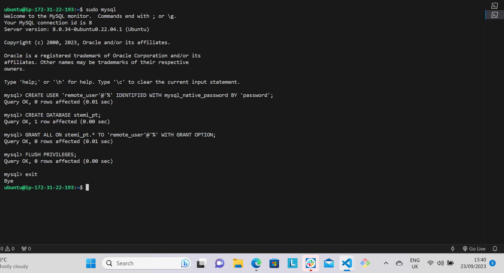
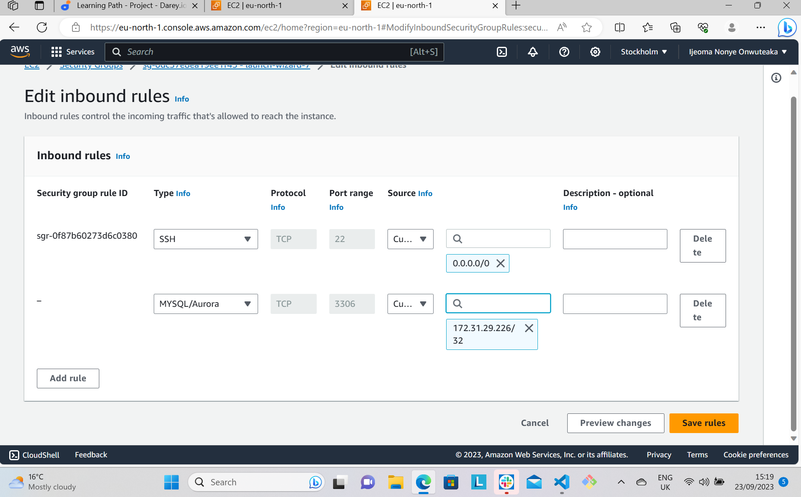
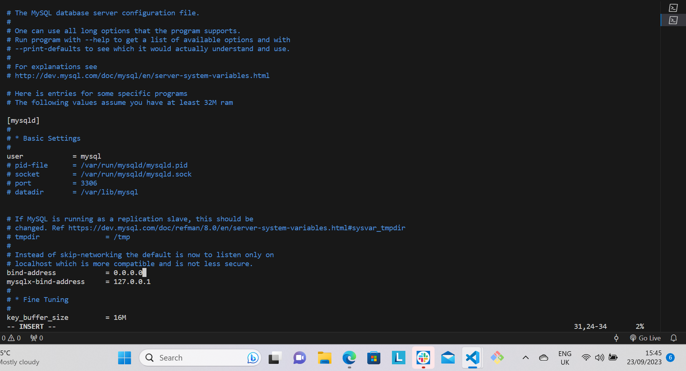
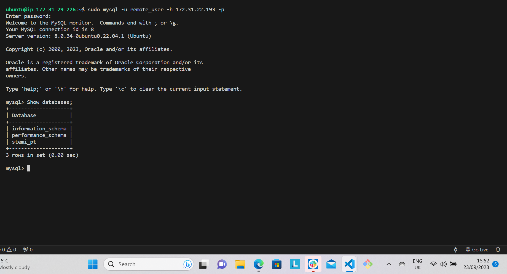

# CLIENT-SERVER ARCHITECTURE WITH MYSQL

## Prerequsites
- Have a Cloud Service Provider such as AWS.
- Launch two EC2 instances and choose Ubuntu as the AMI of the instances.
- Connect your instances to your virtual host through SSH.

STEP 1 - Go to your AWS Management Console and launch two instances. Name them as below:

server 1 - '*mysql-server*'

server 2 - *'mysql-client'*

Step 2 - On *mysql-server*, install mysql software with use of this command:

```python
'sudo apt install mysql-server -y'
```

To run an interactive script, run this command:

```python
'sudo mysql_secure_installation'
```

It will ask you to VALIDATE PASSWORD PLUGIN.

After validating password, log into Mysql console by typing -

```python
'sudo mysql'
```

Create user and set a password for the user by typing:

```python
'CREATE USER 'remote_user'@'%' IDENTIFIED WITH mysql_native_password BY 'your chosen password''
```

Then to create database. run:

```python
'CREATE DATABASE stemi_pt'
```

Next is to grant access to the created user, type:

```python
'GRANT ALL ON stemi-pt.* TO 'remote_user'@'%' WITH GRANT OPTION;'
```
Followed by '*FLUSH PRIVILEGES*' command

Exit mysql console by typing '*exit*'.



STEP 3 - On *'mysql-client'* install MySQL client software by typing in this command:

```python
'sudo apt install mysql-client -y'
```

STEP 4 - To enable the two servers to communicate to each other using local IP address, go to mysql-server instance and create a new inbound rule on the security group which is TCP port 3306. Mysql server listens to port 3306 by default. For security purpose, do not allow all IP address to reach your *'mysql server'* rather allow access to only the local IP address of your *'mysql client'*.



STEP 5 - Configure MySQL server to allow connections from remote host. Run this command:

```python
'sudo vi /etc/mysql/mysql.conf.d/mysqld.cnf' 
```
Replace '127.0.0.1' to '0.0.0.0'



STEP 6 - Connect remotely from mysql client server to mysql database engine using only mysql utility. On your mysql client virtual host, run this command:


```python
sudo mysql -u remote_user -h 'ip address of your mysql server'
```

It will prompt you for password, type in the password you created for remote_user.

Step 7 - To show that you have successfully connected to remote MySQL server, type in this command:

```python
'Show databases;'
```
It should give you a page like this:

